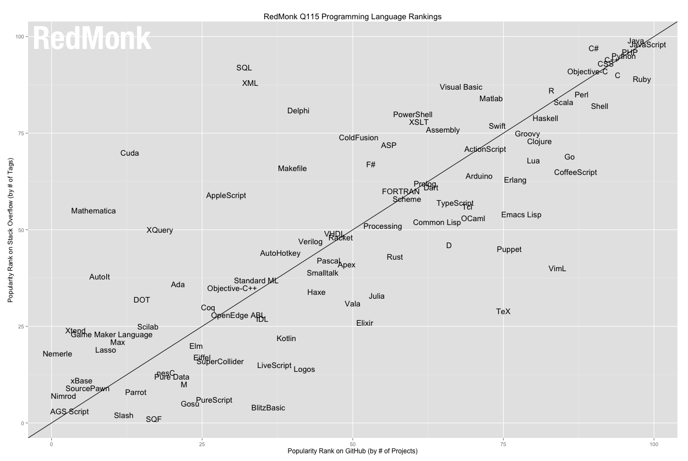
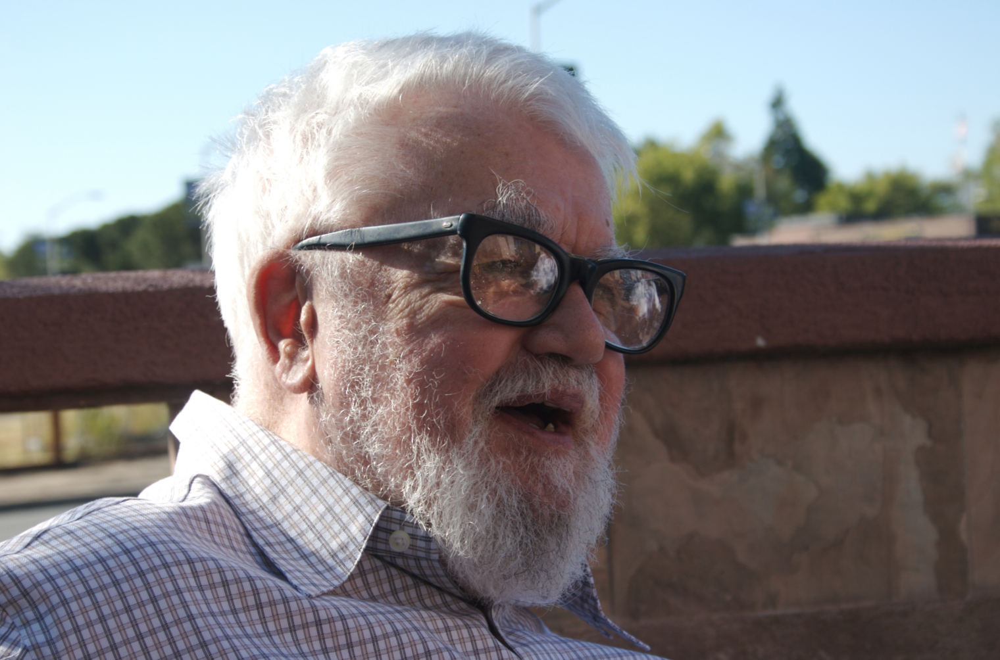
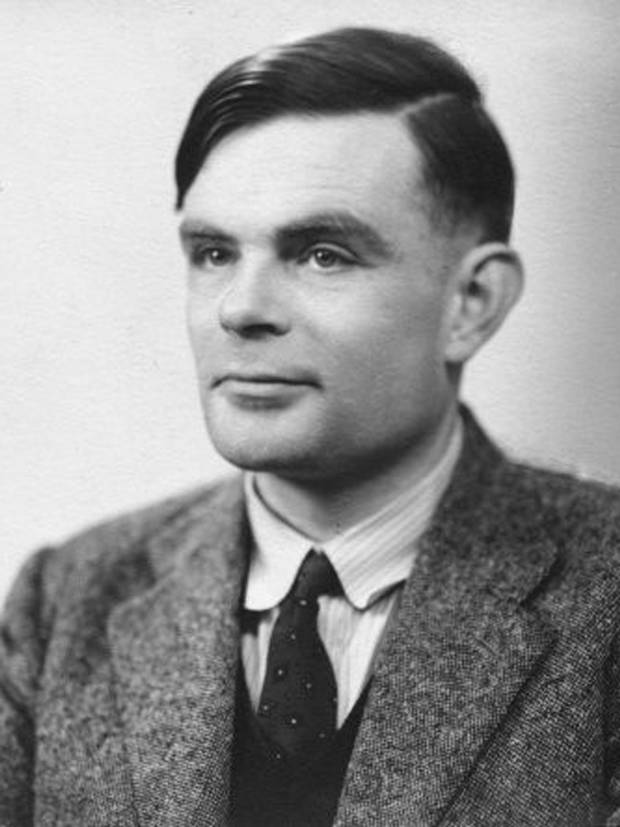
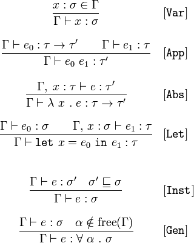
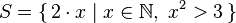

Haskell Day 1
===

---

---

---

Or maybe
---

[This has been your experience](https://github.com/Dobiasd/articles/blob/master/programming_language_learning_curves/javascript.png)

More Than a Language
---

> I know why you're here. ...why you hardly sleep, why night after night, you sit by your computer.

Me?
---

-   I have a hard time with large code bases.
-   I make stupid mistakes - indexes, null pointers, unexpected mutation, etc
-   I HATE verbose code (traiditional static typing)
-   I like documentation - knowing what things do even if comments are bad

-   Really it all came down to productivity

Why this class?
---

I want to build a community.

History - 1930's
---

Alonzo Church invented [λ-calculus](ftp://ftp.cs.ru.nl/pub/CompMath.Found/lambda.pdf)

---

Then John McCarthy invented [Lisp](http://www.gnu.org/software/emacs/emacs-lisp-intro/html_node/lambda.html)

Contrast
---

Turing and machine code.

Equated in expressiveness in 1937.

Functional Legacy
---

-   Garbage Collection
-   Memory Abstraction
-   If – Then – Else
-   Generics
-   Lambdas
-   Tree data structures
-   Dynamic typing
-   Higher-order functions

Many of these are why it's taken until now to take off.

---

Functional

    Haskell, Lisp, ML, Scheme, Erlang
    how to spot: Focuses on "what"

Imperative

    C++, Java, Python, Pascall
    how to spot: Focuses on "how"

Example
---

    void f(int a[], int lo, int hi)
    {
      int h, l, p, t;

      if (lo < hi) {
        l = lo;
        h = hi;
        p = a[hi];

        do {
          while ((l < h) && (a[l] <= p))
              l = l+1;
          while ((h > l) && (a[h] >= p))
              h = h-1;
          if (l < h) {
              t = a[l];
              a[l] = a[h];
              a[h] = t;
          }
        } while (l < h);

        a[hi] = a[l];
        a[l] = p;

        f( a, lo, l-1 );
        f( a, l+1, hi );
      }
    }

VS:
---

    f []     = []
    f (p:xs) = (f lesser) ++ [p] ++ (f greater)
        where
            lesser  = filter (< p) xs
            greater = filter (>= p) xs

    qsort :: Ord a => [a] -> [a]

-   No variables assigned
-   No array indexes
-   No memory management

Haskell
---

Committee of smart people defining open standard.

-   MIT
-   Chalmers University
-   Mitre Corp
-   Victoria University of Wellington
-   Simon Fraser University
-   University of Cambridge
-   Yale University
-   University of Glasgow
-   Microsoft Research Ltd

87' committee, '90 Haskell, '03 Stable

Core Principles
---

1.  Type Inference (python look, better than java protection)
2.  Lazy (infinite - mathy)
3.  Pure Functional (concurrency)
4.  Immutable (show erlang)

Inference
---

That's how we
---

[Rosetta Code has tons of great examples](http://rosettacode.org/wiki/Almost_prime)

[This is another example](http://gregorulm.com/an-example-of-the-beauty-of-haskell/)

Lazy
---

Not evaluated unless needed.  Means you can do this

    take 3 [1..]
    [1,2,3]

    take 10 [1..]
    [1,2,3,4,5,6,7,8,9,10]

    [1..]
    [1,2,3,4...........]

Pure
---

Every function has a return - mathematical.

    s = [ 2*x | x <- [0..], x^2 > 3 ]
    f(x) = x^2 + 1
    f x = x^2 + 1

No side effects.

    -   Optimizations
    -   No global
    -   Order doesn't matter
    -   CONCURRENCY / DISTRIBUTED ease!

Finally
---

Cabal is my way to GHC.  Cabal repl, Cabal build, Cabal install.  Cabal --help here

I use Atom, ide-haskell.

Cabal sandbox for: mod-ghc, stylish-haskell, hoogle, hlint

7.10.1
---

Picked this b/c with Haskell you're still going to be dealing with issues (though now momentum is getting to a point where should be solved.  Many companies using in prod now).

Donezo
---

History
---

-   58 Lisp is born (John Mcarthy)
-   73 C
-   79 C++
-   80's polymorphics
-   87 Functional Programming Languages and Computer Architecture (want lazy)
-   90 Python
-   90 Haskell (MIT / Yale / etc)
-   95 Java
-   00 C#
-   03 Haskell Stable

Haskell
---

[Rosetta Code has tons of great examples](http://rosettacode.org/wiki/Almost_prime)

Named after Haskell Curry
    -   Combinatory Logic

Goals:

-   Pure
-   Lazy
-   Static
-   Immutable
-   Mathematical

Hindley Milner
---

Problem we're solving?  

-   Writing types out can suck.  
-   Even after writing, compiler doesn't help as much as we'd like.

How to solve?

-   Needed a language to talk in a precise way about expressions in languages (Lambda Calculus!)
-   A formal logic on how these interact.  Terse notation - mathematical  or denotational semantics.

Like propositional logic!

[Excellent resource for details on this](http://akgupta.ca/blog/2013/05/14/so-you-still-dont-understand-hindley-milner/)

---

