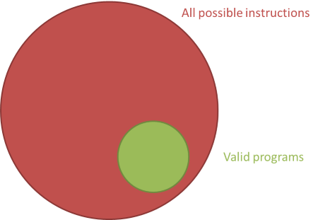
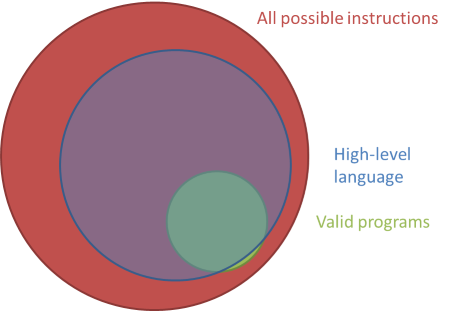
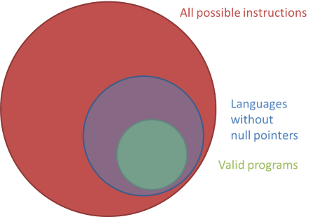
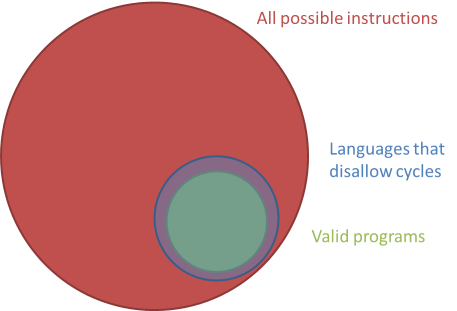
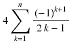

Day 4
===

Billion Dollar Bug
---

Algol in 1965 - Quicksort guy!


Valid vs good
---



---



---



---

No goto, sane numbers, no reference equality, no cycles, no mutation:



HW
---

```haskell
data MetricUnit = Meter | Liter | KiloGram deriving (Show, Eq)
data ImperialUnit = Yard | Gallon | Pound deriving Show
data Measurement = MetricMeasurement Double MetricUnit
                 | ImperialMeasurement Double ImperialUnit
                   deriving Show

-- "m" "L" "kg" - guards and pattern match (needs Eq)
symbol :: MetricUnit -> String
symbol Meter = "m"
symbol Liter = "L"
symbol KiloGram = "kg"

convert :: Measurement -> Measurement
convert (ImperialMeasurement y Yard)  = MetricMeasurement (y * 0.9144) Meter
convert (ImperialMeasurement y Gallon)= MetricMeasurement (y * 3.7854) Liter
convert (ImperialMeasurement y Pound) = MetricMeasurement (y * 0.4536) KiloGram
convert (MetricMeasurement x metric)
    | metric == Meter    = ImperialMeasurement (x * 1.0936) Yard
    | metric == Liter    = ImperialMeasurement (x * 0.2642) Gallon
    | metric == KiloGram = ImperialMeasurement (x * 2.2046) Pound
```

Lets put it in a module, load and run it!
```haskell
ghci>:l Metrics
ghci>convert . convert $ MetricMeasurement 1 Meter
```

Problem 2
---

Binary Tree

. . .

```haskell
data Tree = Branch Int Tree Tree | Node Int | Empty

total :: Tree -> Int
total (Branch v a b) = v + (total a) + (total b)
total (Node x) = x
total (Empty) = 0
```

```haskell
ghci>:l Tree
ghci>total (Branch 1 (Branch 5 (Node 3) (Branch 2 Empty (Node 5))) (Branch 3 (Node 2) Empty))
```

Lambdas
---

Written to look like lambda:

```haskell
\x -> x * 2
λx -> x * 2
```

Higher Order Functions
---

Composition

```haskell
(.) :: (b -> c) -> (a -> b) -> a -> c
f . g = \x -> f (g x)

\x -> negate (abs x)
negate . abs
```

Point Free Style
---

```haskell
fn x = ceiling (negate (tan (cos (max 50 x))))
fn = ceiling . negate . tan . cos . max 50
```

Application
---

```haskell
($)                     :: (a -> b) -> a -> b
f $ x                   =  f x
```

Estimate π
---

Converges to pi:



. . .

```haskell
greg :: Int -> Double
greg x = 4 * (-1) ^ (x + 1) / (2.0 * k - 1)
    where k = fromIntegral x
```
. . .

```haskell
piEstimate :: Int -> Double
piEstimate n = sum $ map greg [1..n]
piEstimate n = foldr (\x acc -> acc + greg x) 0 [1..n]
```

Types Again
---

Think of Sum Types like Enums:

```haskell
data Fruit = Apple | Banana | Pear deriving (Show, Eq, Ord, Enum)

fromEnum Apple
```

But if you're thinking about it in memory, you're doing it wrong.

Maybe
---

```haskell
data Maybe a = Just a | Nothing
```
