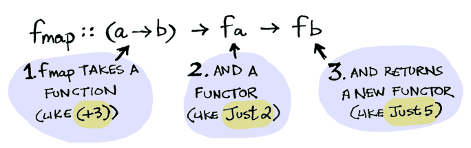

Day 5
===

Pitch
---

-   Top 10 IRC channel: [#haskell](http://irc.netsplit.de/channels/?net=freenode)
-   Reddit: > 10k subscribers
-   Stack Overflow: > 10k questions
-   Learn from smarter people.


MONADS
---


Why?
---

PURE functional.  NO side effects.  Everything returns, should be
deterministic.

Life isn't deterministic.  This is why people think it's not useful.

HOW do we deal with LIFE?
---

-   Side effects in IO
-   Pure everywhere else


Details
---

Drawn from, return (opposites)

```haskell
main :: IO ()
main = do
  putStrLn "quit the program? y/n"
  ans <- getLine
  if ans /= "y" then do
    putStrLn "not quitting"
    main
  else return ()

  -- or
  when (ans /= "y") $ do
    putStrLn "not quitting"
    main
```

Show Project SETUP
---

We'll have:

-   Parsing
-   DB
-   WS Server
-   Solver

Values
---

Next slides are from [this](http://adit.io/posts/2013-04-17-functors,_applicatives,_and_monads_in_pictures.html) excellent tutorial.


Applying Functions
---


Value in context
---


Applying
---

Applying functions now depends on context:


```haskell
data Maybe a = Just a | Nothing
```

How to Apply?
---


Fmap!
---

```haskell
fmap (+3) (Just 2)
```


Functors!
---

Functor is a [typeclass](http://learnyouahaskell.com/types-and-typeclasses#typeclasses-101):


Internals
---

Functor is just a data type that defines fmap for itself:



So we can:

```haskell
instance Functor Maybe where
    fmap func (Just val) = Just (func val)
    fmap func Nothing = Nothing

fmap (+3) (Just 2)
```

Visually
---

Behind the scenes of `fmap (+3) (Just 2)` we get:


What About Nothing?
---

Try to apply `(+3)` to `Nothing` and you get:


```haskell
ghci>fmap (+3) Nothing
Nothing
```

Bottoms
---

Nil is often used as bottom as well as status.
In Haskell we still have [bottom:](http://stackoverflow.com/questions/9392129/detect-bottom-value-in-haskell) `undefined`.  

> Because bottom subsumes non-termination, the function `isUndefined` would have to solve the halting problem and thus cannot exist.

```python
post = Post.find_by_id(1)
if post
  return post.title
else
  return nil
end
```

```haskell
fmap (getPostTitle) (findPost 1)
--- or with infix
getPostTitle <$> (findPost 1)
```

Function to List?
---


Because:

```haskell
instance Functor [] where
    fmap = map
```

What About Functions?
---

Normal:


What About?:
---


```haskell
fmap (+3) (*2)
```

How?
---

```haskell
instance Functor ((->) r) where
    fmap f g = f . g
```

As a functor, it's function composition! As a [monad](http://stackoverflow.com/questions/5310203/how-to-use-instances-of-monad-and-confusion-about):

```haskell
instance Applicative ((->) r) where
   -- pure :: a -> r -> a
   pure = const

   -- (<*>) :: (r -> a -> b) -> (r -> a) -> r -> b
   (<*>) g f r = g r (f r)

instance Monad ((->) r) where
    -- return :: a -> r -> a
    return = const
    -- (>>=) :: (r -> a) -> (a -> r -> b) -> r -> b
    (>>=) x y z = y (x z) z
```

Applicatives
---

Both are wrapped in contexts!

```haskell
Just 2
Just (+3)
```

 

To interact:
---


```haskell
ghci>Just (+2) <*> Just 5
```

More Complicated now
---

From [base:](https://hackage.haskell.org/package/base-4.8.0.0/docs/src/GHC-Base.html#%2B%2B)

```haskell
instance Functor [] where
    fmap = map

instance Applicative [] where
    pure x    = [x]
    fs <*> xs = [f x | f <- fs, x <- xs]
    xs *> ys  = [y | _ <- xs, y <- ys]

instance Monad []  where
    xs >>= f             = [y | x <- xs, y <- f x]
    (>>) = (*>)
    return x            = [x]
    fail _              = []
```

What is this?
---

```haskell
-- So... what is this?
[(*2),(+3)] <*> [1, 2, 3]
```

. . .


Applicatives CAN, Functors CAN'T
---

Apply function that takes 2 args to 2 wrapped values!

```haskell
ghci>(+) <$> (Just 5)
Just (+5)
ghci>Just (+5) <$> Just 4
ERRRRR
```

. . .

```haskell
-- Applicative
ghci>(+) <$> Just 5 <*> Just 4
Just 9
ghci>liftA2 (*) (Just 5) (Just 3)
Just 15
```
