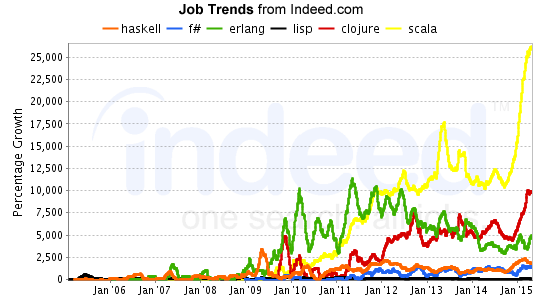

Day 6
===

Pitch
---
New languages like Rust using [Haskell's ideas](https://ruudvanasseldonk.com/2015/06/17/exceptional-results-error-handling-in-csharp-and-rust)

Growth
---


Functional
---
 

Using C
---

[inline-c](https://hackage.haskell.org/package/inline-c)

```haskell
c_cos :: CDouble -> IO CDouble
c_cos x = [C.exp| double { cos($(double x))} |]

calc_nnls :: CInt -> IO CFloat
calc_nnls x = [C.exp| float { calc_nnls_maxiter($(int x))} |]

main = do
    vl <- c_cos 3.0
    print vl
    v2 <- calc_nnls 3
    print v2
```

MONADS
---

Functor Laws
---


For this to work as we'd expect, we need ONLY functor, nothing more:

-   Identity
-   Composition

Example
---

```haskell
fmap (+3) $ Just 2
---
fmap id = id
fmap (f . g) = fmap f . fmap g
--or
fmap (f . g) F = fmap f (fmap g F)
```

And
---

Ok, we can do multiple wrapped values:


```haskell
>(++) <$> getLine <*> getLine
```

Monoids
---

Enter category theory!

A [Group](https://simple.wikipedia.org/wiki/Group_theory) without the
requirement of an inverse, or a [Category](https://en.wikipedia.org/wiki/Monoid#Relation_to_category_theory)
with a single object.

1. ∀ a,b ∈ S: a•b ∈ S
The Set (S) is closed under the binary function (•).
2. ∀ a,b,c ∈ S: (a•b)•c = a•(b•c)
The binary function is associative
3. ∃ e∈S: ∀ a∈S: e•a = a•e = a
e is the identity element

Example
---

```haskell
[1,2,3] `mappend` [3,4,5]
mempty `mappend` [1,2,3]
[1,2,3] `mappend` mempty
```

Now Back Again
---

Monoids in the category of endofunctors... ok forget I said that.

We have `m a` and `a -> m b`.  We need:

```haskell
thing :: m a -> (a -> m b) -> m b
-- which is
(>>=) :: (Monad m) => m a -> (a -> m b) -> m b
```


<!-- And
---

 -->

Back to Maybe
---

```haskell
-- m a 
Just 10
-- a -> m b
half :: Integral a => a -> Maybe a
half x = if even x then Just (x `div` 2) else Nothing
```


What if feed wrapped?
---


Force it!
---


Plunger
---

Plunger is `>>=`

```haskell
> Just 3 >>= half
Nothing
> Just 4 >>= half
Just 2
> Nothing >>= half
Nothing
```
---


```haskell
instance Monad Maybe where
    Nothing >>= func = Nothing
    Just val >>= func  = func val
```

---


Even Simpler
---


---


Also
---

`>>` ignores the value:

```haskell
print "foo" >>= \_ -> print "bar"
print "foo" >> print "bar"

main = do
    print "foo"
    print "bar"
```

Do v Bind
---

```haskell
main = do
    putStrLn "Enter name:"
    name <- getLine
    putStrLn ("Hi " ++ name)

main = putStrLn "Enter name:" >> getLine >>= putStrLn.("Hi " ++)
```

Monad Laws
---

Form a [category](http://en.wikipedia.org/wiki/Category_theory)

1. Left Identity
return a >>= f ≡ f a
2. Right Identity
m >>= return ≡ m
3. Associativity
(m >>= f) >>= g ≡ m >>= (\x -> f x >>= g)


Examples
---

Maybe, list


---


---


---


---


